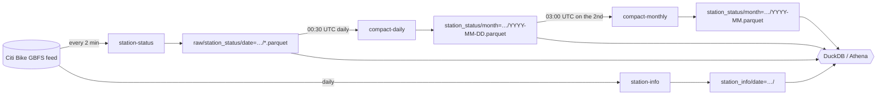

# citi-bikecaster

Every two minutes since September 2016, this project has saved the state of
every [Citi Bike](https://citibikenyc.com) station: how many bikes, e-bikes and
empty docks it has. That's about **3.9 billion rows**. They're stored as about
9 GB of parquet on S3, ready to query with [DuckDB](https://duckdb.org) or
Athena, and nothing needs to be downloaded first.

```
$ make duckdb
D FROM find_station('grand army');
D SELECT hour(fetched_at) AS hour, avg(num_bikes_available) FROM status
  WHERE month = '2026-08' AND station_id IN (SELECT station_id FROM find_station('W 21 St & 6 Ave'))
  GROUP BY ALL ORDER BY hour;
```

---

## Quick start

You need AWS credentials that can read `s3://insulator-citi-bikecaster`. The
default is profile `rd`; set `AWS_PROFILE` to use another. You also need
[uv](https://docs.astral.sh/uv/).

```sh
make duckdb
```

That opens a DuckDB shell with these objects already defined. It uses the
official `duckdb-cli` package through `uvx`, so it works even if your system
`duckdb` is old.

| Name | What it is |
| --- | --- |
| `status` | Every snapshot from 2016-09 through yesterday |
| `recent` | Raw snapshots from the last ~14 days, including today |
| `station_info` | Station names, locations and capacity: weekly since 2019-08, daily since 2026-09 |
| `stations` | One row per `station_id` with its latest name, location and capacity |
| `find_station('…')` | Case-insensitive search of `stations` by name |

The session shows timestamps in NYC time.

To use your own DuckDB (≥ 1.1) instead:

```sql
CREATE SECRET (TYPE s3, PROVIDER credential_chain, PROFILE 'rd', REGION 'us-east-1');
FROM read_parquet('s3://insulator-citi-bikecaster/v2/station_status/*/*.parquet', hive_partitioning = true)
LIMIT 10;
```

## Query cookbook

All of these are in [`queries/examples.sql`](queries/examples.sql) and were
tested against the live data. The times are from a laptop reading S3 over the
internet.

**How much data is there?** About 3 s; it reads only the parquet footers.

```sql
SELECT month, count(*) AS rows FROM status GROUP BY ALL ORDER BY month;
```

**Find a station.** In early 2023 the feed switched station ids from numbers
to UUIDs, so long-lived stations appear under both.

```sql
FROM find_station('grand army');
```

**What's at a station right now?** About 0.3 s; it reads only the newest
snapshot file.

```sql
SET VARIABLE latest = (
    SELECT max(file) FROM glob('s3://insulator-citi-bikecaster/v2/raw/station_status/*/*.parquet')
);
SELECT s.name, r.fetched_at, r.num_bikes_available, r.num_ebikes_available, r.num_docks_available
FROM read_parquet(getvariable('latest')) r JOIN stations s USING (station_id)
WHERE s.name ILIKE '%grand army%';
```

**A typical day at one station.** About 1 s; filtering on `month` skips every
other file.

```sql
SELECT hour(fetched_at) AS hour_nyc,
       round(avg(num_bikes_available), 1) AS avg_bikes,
       bar(avg(num_bikes_available), 0, 60, 30) AS chart
FROM status
WHERE month = '2026-08'
  AND station_id IN (SELECT station_id FROM find_station('W 21 St & 6 Ave'))
GROUP BY ALL ORDER BY hour_nyc;
```

**Which stations are most often empty?**

```sql
SELECT s.name, round(100 * avg((num_bikes_available = 0)::int), 1) AS pct_empty
FROM status JOIN stations s USING (station_id)
WHERE month = '2026-08' AND is_renting
GROUP BY ALL HAVING count(*) > 10000
ORDER BY pct_empty DESC LIMIT 15;
```

The examples file also covers system-wide daily bike totals, network growth
by year, exporting one station's full history to CSV, and downloading
everything into a single local parquet file.

**Tips**

- Always filter on `month` (`'YYYY-MM'`, in UTC) when you can. Each month is
  one file, and DuckDB skips the ones you don't ask for.
- Only the columns you select are downloaded. `SELECT *` over all history
  pulls the full ~9 GB.
- For repeated heavy analysis, make a local copy once with
  `COPY status TO 'citibike.parquet'`, or run `scripts/dump.sh duckdb`.

## The data

### Layout

Everything lives under `s3://insulator-citi-bikecaster/v2/`:

```
station_status/month=2026-08/2026-08.parquet     one zstd file per closed month (~150 MB)
station_status/month=2026-09/2026-09-23.parquet  daily files for the current month
raw/station_status/date=2026-09-24/*.parquet     2-minute snapshots, deleted after 14 days
station_info/date=2026-09-24/station_info.parquet
```

Rows within each file are sorted by `station_id, fetched_at`, which is why a
month of ~50M rows compresses to ~150 MB.

### `station_status` columns

| Column | Type | Notes |
| --- | --- | --- |
| `fetched_at` | timestamp (UTC) | When the feed was polled. See `source` for how accurate it is. |
| `feed_last_updated` | timestamp (UTC) | The feed's own `last_updated`; null for legacy rows |
| `station_id` | string | Numeric before 2023-03, UUID after |
| `legacy_id` | string | The old numeric id for a UUID station (`live` rows only) |
| `num_bikes_available` | int | Includes e-bikes |
| `num_ebikes_available` | int | Null before 2019-08 |
| `num_bikes_disabled`, `num_docks_available`, `num_docks_disabled` | int | Null before 2019-08, except `num_docks_available` |
| `is_installed`, `is_renting`, `is_returning` | bool | Null before 2019-08 |
| `last_reported` | timestamp (UTC) | When the station last checked in; null if never |
| `source` | string | Where the row came from; see below |

`source` values:

| Value | Rows | Meaning |
| --- | --- | --- |
| `live` | 2026-09-24 onward | Written by the current pipeline |
| `legacy_raw` | 2019-08-02 to 2026-09-23 | Rebuilt from the original 2-minute snapshot files, so `fetched_at` is exact |
| `legacy_hourly` | 2016-09 to 2019-07, plus the 7 days listed below | Rebuilt from hourly files, so `fetched_at` is only accurate to the hour |

### Data quality notes

- **Gaps:** 2017-07 is nearly empty and 2017-08 has no data. Otherwise there
  are ~720 snapshots per day.
- **Hourly-only days:** 2019-08-01, 2019-10-05, 2020-11-25, 2021-12-07,
  2023-06-13, 2023-08-04 and 2025-10-20 have incomplete raw snapshots, so
  they fall back to the hour-level data.
- **Duplicates:** from 2023-08-05 to 2023-09-07 the feed listed most stations
  twice per snapshot. Exact duplicate rows are removed, 49.1M in total. About
  1.5% of those pairs differ in some value, and both rows are kept.
  2023-08-04 is hour-level data, where duplicates can't be told apart from
  real repeated snapshots, so it still has them.
- **Sentinels:** GBFS uses tiny epoch values such as `86400` for "never
  reported". Any `last_reported` before 2001 is null.

## Athena

Database `citibike` in workgroup `citibike` has three tables:
`station_status`, `station_status_raw` and `station_info`. They use partition
projection, so new data shows up with no crawler or `MSCK REPAIR`.

```sh
uv run scripts/athena.py "SELECT month, count(*) FROM citibike.station_status GROUP BY 1 ORDER BY 1"
```

### Dumps

```sh
scripts/dump.sh athena                   # Athena CTAS → one zstd parquet file per year, in S3
scripts/dump.sh duckdb citibike.parquet  # everything → one local parquet file
```

The Athena version runs the saved query **dump station_status**. It writes to
`s3://insulator-citi-bikecaster/v2/dumps/<timestamp>/year=YYYY/` and registers
the dump as a table.

## How it works



The Lambda functions are all Python 3.14 on arm64, with a shared pyarrow
layer. They're defined in [`template.yaml`](template.yaml), a SAM template
deployed as the CloudFormation stack `citibike-v2`.

| Function | Schedule (UTC) | Does |
| --- | --- | --- |
| `citibike-station-status` | every 2 min | Fetch the feed and write one raw parquet file |
| `citibike-station-info` | 00:05 daily | Fetch station metadata |
| `citibike-compact-daily` | 00:30 daily | Merge yesterday's raw files into one sorted daily file, dropping exact duplicates |
| `citibike-compact-monthly` | 03:00 on the 2nd | Merge last month's daily files into one monthly file |
| `citibike-backfill` | manual | Rebuild legacy data into this layout |

Compaction is idempotent and safe to re-run. The monthly file records which
days it contains, in S3 object metadata. A day already sealed into a monthly
file can't be compacted again, and leftover daily files from an interrupted
run are cleaned up instead of being double-counted.

Code lives in [`src/bikecaster/`](src/bikecaster):

- `ingest.py`: the two pollers
- `compact.py`: daily and monthly compaction
- `backfill.py`: legacy conversion
- `common.py`: schema, S3 layout and normalization

## Operating it

```sh
make deploy STAGE=prod           # build the layer, package, deploy the citibike-v2 stack
make deploy STAGE=dev            # citibike-v2-dev: writes to s3://…/dev/v2/, db citibike_dev
make invoke STAGE=prod FN=station-status
make invoke STAGE=prod FN=compact-daily EVENT='{"date": "2026-09-22"}'
make invoke STAGE=prod FN=compact-monthly EVENT='{"month": "2026-09"}'
make logs STAGE=prod FN=compact-daily
make lifecycle                   # apply infra/lifecycle.json to the bucket
```

- **Bucket ownership.** The stacks reference the existing bucket but never
  create or delete it. For the same reason, the bucket's lifecycle rules live
  in [`infra/lifecycle.json`](infra/lifecycle.json) rather than in the
  template.
- **Backfill tooling.** `scripts/backfill.py` drives the backfill Lambda
  month by month. It's resumable, it has a `verify` subcommand, and it
  converts legacy `station_info` with `station-info`. The full history was
  converted in September 2026; see the script's docstring for how.

## Development

```sh
uv sync
make test        # unit tests: moto S3, recorded GBFS responses and real legacy files from each era
make test-live   # smoke test against the real feed
```

## History

The original 2019 version ran on Serverless with Python 3.6. It wrote one
fastparquet file per poll, concatenated them into hourly files, and added
Athena partitions with a nightly Lambda. In September 2026 it was replaced by
the pipeline above, and all history was converted into the new layout. The
hourly files shrank from ~80 GB to ~9 GB, and fetch times were recovered from
the original snapshot files where they still existed.
